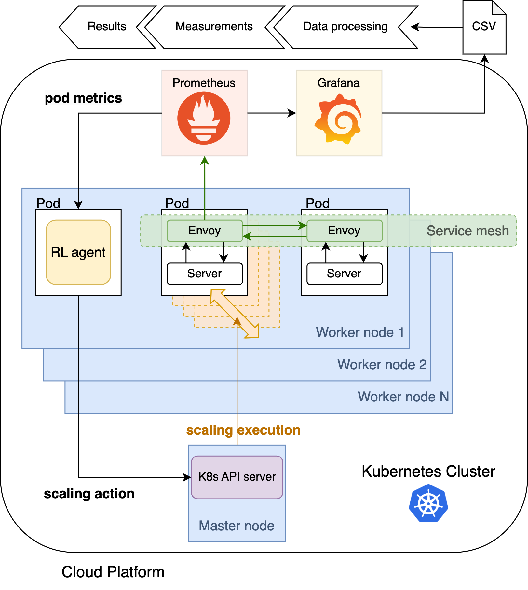

---
# Deploying an intelligent autoscaler into a Kubernetes cluster

The purpose of this repository is to train an agent with reinforcement learning so that it can outperform a standard [Horizontal Pod Autoscaler (HPA)](https://kubernetes.io/docs/tasks/run-application/horizontal-pod-autoscale/) by allocating resources in a smarter way. This is done by looking at multiple metrics instead of solely relying on CPU utilisation.

The microservice architecture that it is used is built upon [GoogleCloudPlatform/microservices-demo](https://github.com/GoogleCloudPlatform/microservices-demo) v0.5.2. Based on that repository, an RL agent has been developed to take scaling decisions and actually scale-out or -in the services of the Online Boutique when run in Kubernetes.


In the following, there is a guide to deploy the agent in a [Google Kubernetes Engine (GKE)](https://cloud.google.com/kubernetes-engine) cluster and locally using [minikube](https://minikube.sigs.k8s.io/docs/start/).
The local development environment is used mainly for testing the interaction between the agent, the [Prometheus API](https://prometheus.io/docs/prometheus/latest/querying/api/) and the [Kubernetes API](https://kubernetes.io/docs/concepts/overview/kubernetes-api/) before deploying it in the "production" environment in GKE. Indeed, the GKE cluster is used to check the actual behaviour of the algorithm in a more realistic environment, and compare the standard HPA with the intelligent autoscaler.

So take your cup of coffee or tea and let's begin! ☕️

### How it works in a nutshell 🥜


In the cloud platform, I deployed the Kubernetes cluster, which consists of a Master node and multiple worker nodes, which will host all the pods needed by the microservice application Online Boutique.
Each pod contains one or multiple Docker containers, represented by a container with rounded angles in the Figure.
For example, the container *RL agent* contains the code to use the model on the cluster when trained, while *Envoy* represents the sidecar proxy injected by Istio on every pod, next to the *Server* container.
Each *Server* represents a microservice packaged into a container, for example, *productcatalog*, *frontend*, etc.
Each pod is assigned to a node by the *kube-scheduler* based on resource availability, and the whole *Online Boutique* application runs in the same namespace.

The communication between microservices occurs through the service mesh enabled by Istio.
Specifically, Envoy proxies monitor each server and publish these data on an endpoint.
Both Prometheus and Grafana are deployed as pods inside the cluster.
Prometheus scrapes every 5s the metrics from Istio, which collects these from each Envoy proxy present in the cluster.
These metrics are stored in the Prometheus time-series database and are scraped by Grafana and the RL agent.
With Grafana, we can visualise the rate of change of each metric over time in a dashboard, and download this data in our local development environment to process it and make our measurements.

The scaling action is performed by the RL agent container based on the observed state of the cluster.
In fact, the agent queries Prometheus to receive aggregated pod metrics, representing state $S_{t}$, and takes a scaling action $A_{t}$ accordingly, by calling the *kube-api-server* in the master node.
Kubernetes is then responsible for executing the scaling action by increasing or decreasing the number of replicas in the target deployment.

## Developing on a cloud platform ☁️
Here, the agent is deployed in a cloud environment that is similar to a real-world scenario where scalability, availability and security are the main concerns. 

> :warning: Cloud computing comes with a cost 💸🏭
> 
> Using GKE, you will be charged for the resources you use.
> The main costs will occur for the following resources:
> - [Compute Engine](https://cloud.google.com/compute/all-pricing), for a VM instance
> - [Filestore](https://cloud.google.com/filestore/pricing), for an NFS server instance
> - [Kubernetes Engine](https://cloud.google.com/kubernetes-engine/pricing), for nodes utilisation
> - [Container Registry](https://cloud.google.com/container-registry/pricing), for container images storage

*Picture of the infrastructure*.

### Setting up all components
First things first, you have to create a project with your Google account on Google Cloud Platform (GCP) as indicated [in the official documentation](https://cloud.google.com/resource-manager/docs/creating-managing-projects).

Next, the following components are needed to have everything working on GKE.
Specifically, we will connect to the Kubernetes cluster with a virtual machine and manage our pods and the agent from there.

#### Virtual Machine (VM) as main workstation to connect to the Kubernetes cluster
This VM will be used to run commands like `kubectl` to interact with the cluster and `git pull` to get the latest changes from the repository when developing.

1. [Create a VM instance](https://cloud.google.com/compute/docs/instances/create-start-instance) with at least 2 vCPUs, 4GB of memory, 20GB of disk and Ubuntu as OS.
2. SSH to the machine from your local computer or from the browser. You can use `gcloud compute ssh --zone "<your_zone>" "<vm_instance_name>" --project "<your_proect-name>"` or directly from the user interface in GCP.

##### What to install in the Ubuntu VM
- **gcloud SDK**: [follow these instructions to install the SDK](https://cloud.google.com/sdk/docs/install#deb) and then
	1. Install the package to authenticate with GKE `sudo apt-get install google-cloud-cli-gke-gcloud-auth-plugin` 
	2. Install the Kubernetes command line if not already present with `sudo apt-get install kubectl`
- **GitHub CLI**: [follow these instructions to install gh](https://github.com/cli/cli/blob/trunk/docs/install_linux.md), which will be necessary to authenticate to GitHub, push and pull changes to the repository. The complete command is reported below.
```
type -p curl >/dev/null || (sudo apt update && sudo apt install curl -y)
curl -fsSL https://cli.github.com/packages/githubcli-archive-keyring.gpg | sudo dd of=/usr/share/keyrings/githubcli-archive-keyring.gpg \
&& sudo chmod go+r /usr/share/keyrings/githubcli-archive-keyring.gpg \
&& echo "deb [arch=$(dpkg --print-architecture) signed-by=/usr/share/keyrings/githubcli-archive-keyring.gpg] https://cli.github.com/packages stable main" | sudo tee /etc/apt/sources.list.d/github-cli.list > /dev/null \
&& sudo apt update \
&& sudo apt install gh -y
```
- **Docker**: [follow these instructions to install Docker](https://docs.docker.com/engine/install/ubuntu/#install-using-the-repository) and `sudo chmod 666 /var/run/docker.sock` after the installation to provide the right permissions to access Docker socket.

#### Network Files System (NFS) server as shared persistent disk
A persistent disk that can be shared across all components is necessary because virtual machines and containers are by definition ephemeral and there is no guarantee that data will be available across sessions. An NFS server will be used to share storage between the VM and pods.

You can [follow these guidelines](https://cloud.google.com/filestore/docs/create-instance-console) to set up a NFS server with [Google Filestore](https://cloud.google.com/filestore/docs).
On the VM:
1. Change directory and go into the mounted volume `cd /mnt/<dir_name>` 
2. Create folder `keys/` to store secret keys created in the following steps.
3. Clone this repository with `git clone`.

> :warning: If the VM is restarted you need to remount the volume (the address of the NFS server may have changed)
>
>`sudo mount <nfs_server_ip_address>:/vol1 /mnt/nfs-client`
>`sudo chmod go+rw /mnt/nfs-client`

This volume will be claimed by certain pods using a [Persistent Volume Claim](https://kubernetes.io/docs/concepts/storage/persistent-volumes/).

### Create a GKE cluster
You can follow the [official documentation](https://cloud.google.com/kubernetes-engine/docs/how-to/creating-a-zonal-cluster) to set up your standard cluster. Nodes of type `e2-standard-4` are sufficient with capacity to run the application and scale it.

Now it's time to authenticate into the cluster from the VM. Run the following commands:
1. Authenticate to the platform with your Google account with `gcloud auth login`
2. Enter the project you created with  `gcloud config set project PROJECT_ID`
3. Log into the cluster with `gcloud container clusters get-credentials <cluster-name> --zone <zone_of_your_cluster>`
4. You can try to create a namespace with `kubectl create namespace rl-agent`

To push Docker images in the Container Registry at `gcr.io/<your_project_name>` you will need to authenticate Docker to the Registry. 
You can follow the [official documentation](https://cloud.google.com/artifact-registry/docs/docker/authentication) to show how to authenticate or simply run `gcloud auth configure-docker`. 

To enable Kubernetes to pull the container images from your private Container Registry you have to create a JSON key file and embed it as a [Kubernetes secret](https://kubernetes.io/docs/concepts/configuration/secret/).
[Create a Service Account](https://cloud.google.com/iam/docs/service-accounts-create) with Viewer permissions and create the key file to be stored in `/keys/` with  `gcloud iam service-accounts keys create KEY_FILE --iam-account=SA_NAME@PROJECT_ID.iam.gserviceaccount.com`.

With Kubernetes point to the key file to create a secret and name it `gcr-json-key`.
You will need to run the following command both for the `default` namespace and `rl-agent` so that both namespaces will be able to pull the needed images.
```
kubectl create secret docker-registry gcr-json-key \
--docker-server=gcr.io \
--docker-username=_json_key \
--docker-password="$(cat ~/keys/img_pull_key.json)" \
--docker-email=<service-account-email> \
--namespace rl-agent
```
Check that these secrets have been created correctly with `kubectl get secrets`.

Another key file is needed, this time for the agent to authenticate to the GKE cluster from within its pod. You can use the default service account to create a second JSON key and save it to `/keys/`.

> :warning: Security
>
> This secret will be copied directly into the image and this is a security concern. A more secure implementation would be to create a Kubernetes secret and import this secret into the pod. 

### Monitoring tools installations 📊
Monitoring will be used for two main purposes. One is to provide the agent with the necessary information about the current state of the cluster to take the necessary action. The other is to monitor the behaviour of the intelligent autoscaler and compare it with the standard HPA.

These components are [Istio](https://istio.io/latest/about/service-mesh/#what-is-istio), an open-source service mesh framework providing monitoring and load balancing capabilities, [Prometheus](https://prometheus.io/docs/introduction/overview/#what-is-prometheus) and open-source time-series database used to store monitored data scraped from Istio, and [Grafana](https://grafana.com/oss/grafana/), an open-source project providing a monitoring dashboard connected to the database.
Moreover, the Prometheus API will be queried by the agent to get the state of the environment. How the taken action affects the environment will be visible on a Grafana dashboard.

By default, Kubernetes emits only certain basic metrics but the agent needs to know the current number of replicas that are being deployed. To enable this metrics you have to install the [kube-state-metrics server](https://github.com/kubernetes/kube-state-metrics#kube-state-metrics-vs-metrics-server).
The installation is very simple:
1. Download the official repository with `git clone https://github.com/kubernetes/kube-state-metrics`
2. Apply its manifests for the standard installation `kubectl apply -f kube-state-metrics/examples/standard/`

You should now see a pod named similar to `kube-state-metrics-65bf754b96-cvp75` when you list all pods with `kubectl get pods -A`
The file `prometheus.yaml` instructs Prometheus to scrape from this server, among other jobs.

#### Service mesh with Istio ⛵️
Next install Istio 1.17.1 by following the [official documentation](https://istio.io/latest/docs/setup/getting-started/#download).
`curl -L https://istio.io/downloadIstio | ISTIO_VERSION=1.17.1 TARGET_ARCH=x86_64 sh -`

Use the default profile `istioctl install --set profile=default -y`  and label both namespaces for the injection of the [Envoy sidecar](https://istio.io/latest/docs/ops/deployment/architecture/#envoy) with `kubectl label namespace <namespace_name> istio-injection=enabled`. The sidecar is the component that will emit those metrics scraped by Prometheus.

##### Enabling Prometheus and Grafana
Prometheus, Kiali and Grafana are enabled with `kubectl apply -f microservice-demo/kubernetes-manifests/istio-system`.

### Deploy the Online Boutique 🎊
Everything is ready now to deploy the Online Boutique application with all its services!
A replica of the application will be deployed in the `default` namespace and another in the `rl-agent` namespace. The agent will only be present in the latter.

1. Change directory to the repository folder `cd microservice-demo/`
2. . Build the Docker image for the agent `cd src/agent`
3. `docker build -t agent:x.x .` where x.x is the version of the image
4. Tag the image with the path on your Container Registry like `docker tag agent:x.x gcr.io/master-thesis-hpa/agent:x.x`
5. Now push the image to the Registry with `docker push gcr.io/master-thesis-hpa/agent:x.x`
6. Do the same with the loadgenerator `cd src/loadgenerator`, `docker build`, `docker tag` and `docker push`.
7. Deploy the replica of the application in the `default` namespace with `skaffold run --default-repo gcr.io/master-thesis-hpa`
8. Now deploy the application in the `rl-agent` namespace. Go to `cd kubernetes-manifests/rl-agent`
9. Apply the roles that allow the agent to change the number of replicas with `kubectl apply -f agent-role.yaml` and `agent-roleBind.yaml`
10. Deploy all services with `kubectl apply -f ./app`
11. Apply the standard HPA configuration for the `frontend` service in the default namespace with `kubectl apply -f /autoscaling`

> :warning: Update image version in the deployment files after every new versioning
>
> Both in `/kubernetes-manifests/default/loadgeneratory.yaml` and `kubernetes-manifests/rl-agent/app/loadgenerator.yaml` for the load generator and in `kubernetes-manifests/rl-agent/app/agent.yaml`.

#### Generating traffic load on the application with `loadgenerator`
Update the image version in `/kubernetes-manifests/loadgenerator.yaml` with the x.x version of your build and deploy the service with `kubectl apply -f default/loadgenerator.yaml` for the `default` namespace and `kubectl apply -f rl-agent/app/loadgenerator.yaml` for the other namespace.

Once deployed, both generators will simulate a load of requests to `frontend` coming from a varying number of users. These users will look for products, add the to the cart and buy them. User behaviour is randomised across all possible interactions with the website.

### Developing the RL agent 💡
The agent can be deployed with `kubectl apply -f rl-agent/app/agent.yaml`.
Deploying this pod will automatically start the learning phase of the algorithms, which will log and checkpoint models at `microservice-demo/src/agent/`.
You can execute commands inside the pod with `kubectl exec -it -n rl-agent agent-<id> -- /bin/sh`.

---
## Developing locally on minikube 💻 

##### Starting minikube and building images
1. `minikube start`
2. `minikube mount ${HOME}/Documents/microservice-demo:/app/microservice-demo` to mount the volume that will be used by the agent pod to run the code developed locally
3. Open a new terminal
4. `minikube docker-env` and `eval $(minikube -p minikube docker-env)`
5. `cd src/agent-local`
6. `docker build -t agent:<version> .` Remember to change the version of the image in the deployment file to deploy that image in the cluster.
7. `cd src/loadgenerator`
8. `docker build -t loadgenerator:<version> .`

##### Use Istio for monitoring
1. Install Istio following the [official documentation](https://istio.io/latest/docs/setup/getting-started/#download).
2. `istioctl install --set profile=demo -y` this will allow you to use Prometheus and Grafana
3. `kubectl label namespace rl-agent istio-injection=enabled`
4. Verify the labelling with `kubectl get namespaces --show-labels`
5. `cd kubernetes-manifests/`
6. `kubectl -f apply ./istio-system` to deploy Istio components

##### Deploy the Online Boutique application
1. Go to `kubernetes-manifests/rl-agent/local`
4. `kubectl apply -f kube-manifests-local.yaml`
6. `kubectl apply -f loadgenerator-local.yaml`
7. `kubectl apply -f agent-role.yaml`
8. `kubectl apply -f agent-roleBind.yaml`
9. `kubectl apply -f agent-local.yaml`
10. On a new terminal, to run the load generator execute the file `workload_gen.py` from within the pod. `kubectl exec -it -n rl-agent loadgenerator-<id> -- /bin/sh`
11. On a new terminal, to run the agent code execute `kubectl exec -it -n rl-agent agent-<id> -- /bin/sh`

Everything should be running locally by now. 😌
The monitoring part is the same as the one developed in GKE.

>[!note] Note about volumes
>When creating a volume, everything you modify in the pod (including deleted files) will be reflected on the host machine where the volume is created!

>[!tip] Deleting all resources
>To delete all resources in the cluster in a namespace `kubectl delete all --all`.

---
# Resources
Tutorials I used and other references.
[How to a pull Docker Image from GCR in any non-GCP Kubernetes cluster](https://medium.easyread.co/today-i-learned-pull-docker-image-from-gcr-google-container-registry-in-any-non-gcp-kubernetes-5f8298f28969).
[Google Kubernetes Engine(GKE) — Persistent Volume with Persistent Disks (NFS) on Multiple Nodes (ReadWriteMany)](https://medium.com/@athulravindran/google-kubernetes-engine-gke-persistence-volume-nfs-on-multiple-nodes-readwritemany-4b6e8d565b08).
[Kubernetes Monitoring: Kube-State-Metrics](https://chrisedrego.medium.com/kubernetes-monitoring-kube-state-metrics-df6546aea324).
